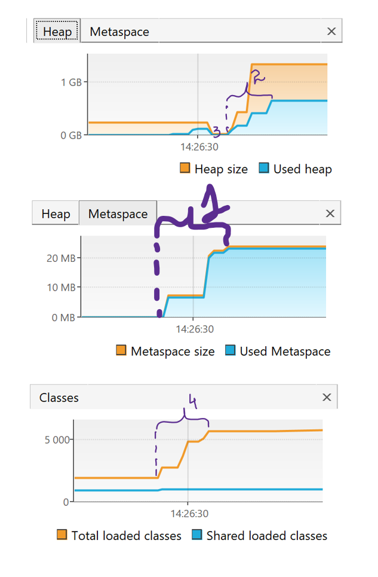

***Вывод***: 
 14:39:26.307844600: loading io.vertx //1
 14:39:27.204417400: loaded 529 classes //2
 14:39:30.223814900: loading io.netty //3
 14:39:32.113503900: loaded 2117 classes //4
 14:39:35.120290500: loading org.springframework //5
 14:39:35.766222200: loaded 869 classes //6
 14:39:38.779226700: now see heap //7
 14:39:38.779226700: creating 5000000 objects //8
 :39:39.883724900: created //9
 14:39:42.891579900: creating 5000000 objects //10
 14:39:43.934299800: created //11
 14:39:47.088176: creating 5000000 objects //12
 14:39:47.544525700: created //13

***Описание***:
1) Выводу строк 1-6 на графике соотвестввует отметка 1: глассы из библиотек io.vertx, io.netty, org.springframework были загружены в metaspace
2) Выводу строк 7-13 соотвествует отметка графика 1: слздавались объекты типа Integer => для них выделялось место в heap
3) Отметка графика 3 - отработал сборщик мусора, удалив неиспользуемые объекты
4) Отметка 4: Classes отображает информацию о классах, которые загружены/использованы в Java-приложении => по временным рамкам видно, что график возрастает аналогично графику metaspace, когда происходила загрузка классов из билиотек
